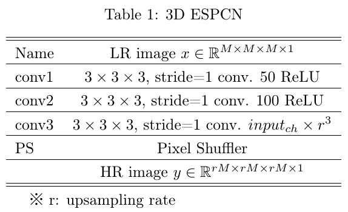
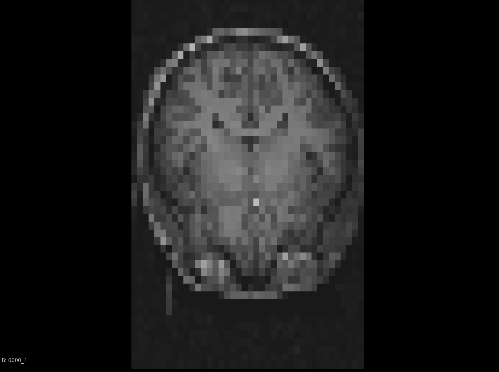
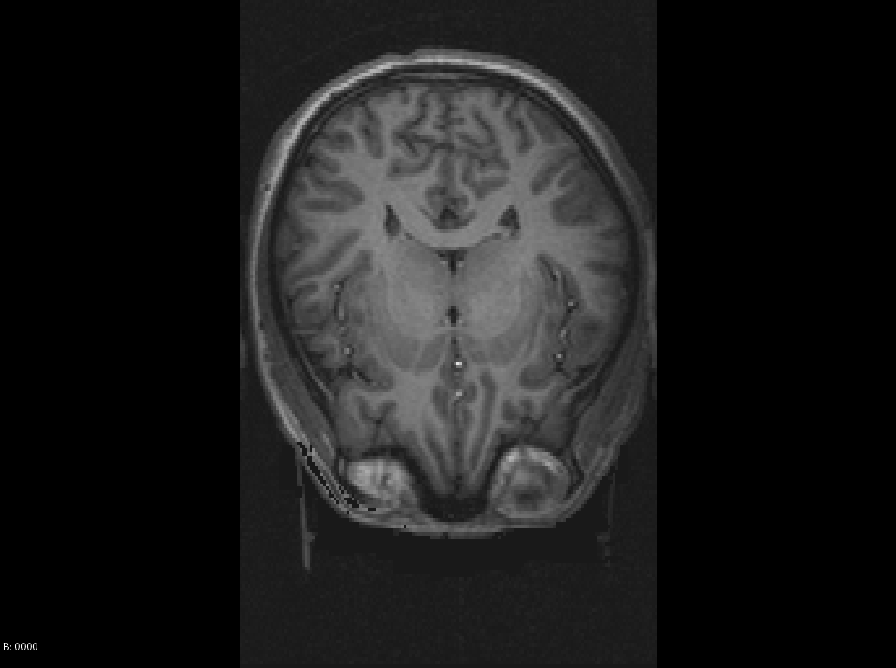
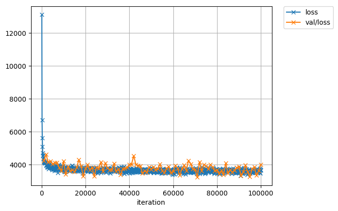
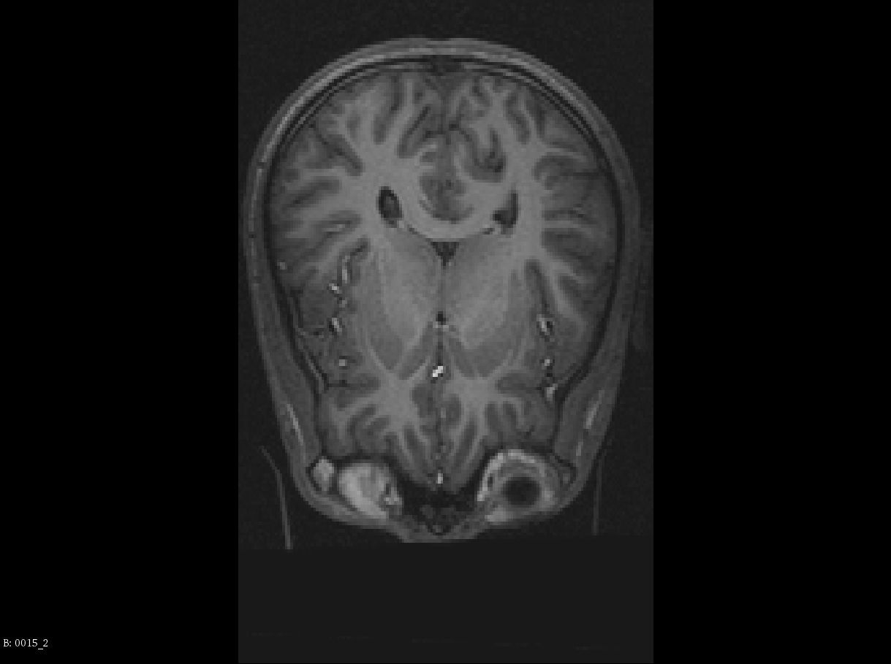
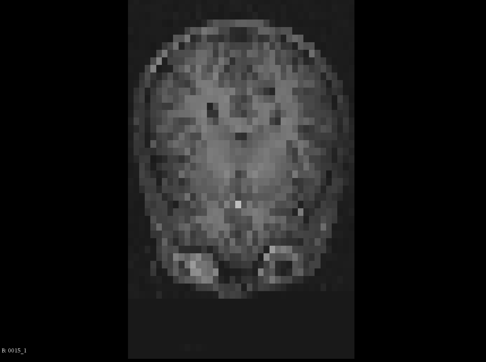
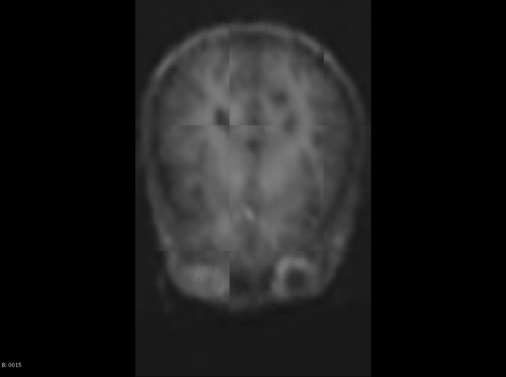

# 3D Efficient Subpixel-shifted Convolutional Network (3D-ESPCN)

This chainer implementation is based on "Tanno R. et al. (2017) Bayesian Image Quality Transfer with CNNs: Exploring Uncertainty in dMRI Super-Resolution. In: Descoteaux M., Maier-Hein L., Franz A., Jannin P., Collins D., Duchesne S. (eds) Medical Image Computing and Computer Assisted Intervention − MICCAI 2017. Lecture Notes in Computer Science, vol 10433. Springer, Cham".

Note that this is not official implementation.

The difference between original paper and this as follow:

- Dataset

  - I used [Balloon Analog Risk-taking Task dataset](https://openneuro.org/datasets/ds000001/versions/00006)

- I only implement baseline model (3D-ESPCN).

  - Network architecture

    

- Definition of pixel shuffler

  I think this is correct definition.

  

  F: input feature map

  c: number of output image channel

  S: Pixel shuffler

  i, j, k, c: coordinate in output image

  r: upsampling rate

## Requirements

- chainer

- cupy

- SimpleITK

- pyyaml

## How to use

1. Download dataset [here](https://openneuro.org/datasets/ds000001/versions/00006).

    Please put all dataset to `data/raw` after you unzipped it.

2. Make mhd data and LR image

    ```
    # Make mhd data in data/interim
    python util\miscs\clean_data.py

    # Make LR and HR images in data/processed
    python util\miscs\make_lr_img.py
    ```

    - LR image sample (x1/4)

    

    - HR image sample

    


3. Train model

    ```
    python training.py -g 0
    ```

    - Training result

      

4. Infer HR images and evaluate infered HR images in terms of PSNR and SSIM.

    ```
    python inference.py -g 0 -m results\training\gen_iter_100000.npz
    ```

    - Inference results

      |Case|PSNR[dB]|SSIM|
      |:---:|:---:|:---:|
      |0014.mhd|24.4|0.303|
      |0001.mhd|26.2|0.390|
      |0015.mhd|30.2|0.459|

    - Example of ground truth (0015.mhd)

      

    - Example of input LR image (0015.mhd)

      

    - Example of infered HR image (0015.mhd)

      

### My opinion

- I think I cant reconstruct detail of image, e.g. texture :sob:

- If you use this implementation, you should optimize this model for your task.

- Note that this is just my hobby. So, please dont care this results. :smile_cat:
